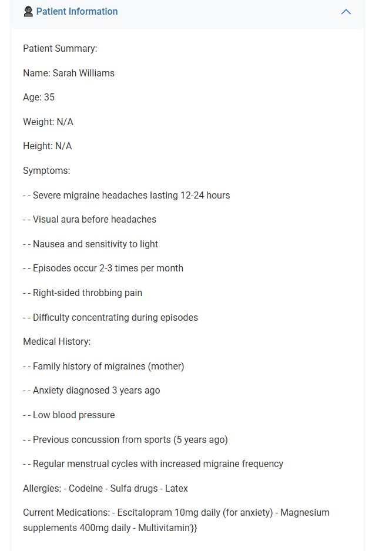
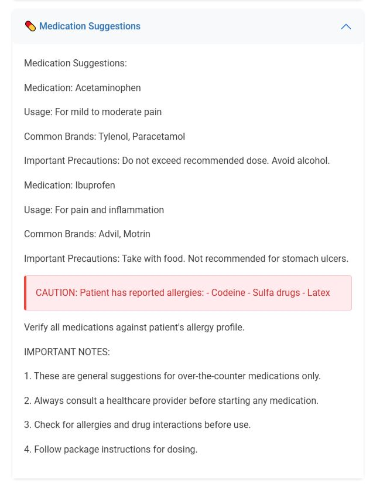
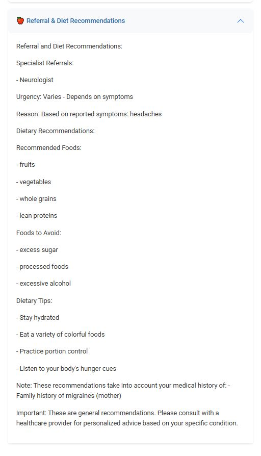
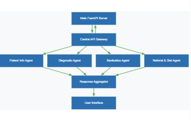
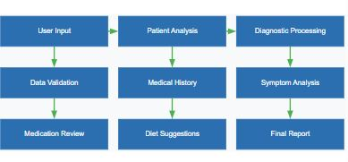

# Doctor.AI - Healthcare Assistant System

A modular, agent-based healthcare assistant system that provides patient information analysis, diagnostic suggestions, medication recommendations, and referral & diet advice using Agent-to-Agent (A2A) architecture.


## Features

- 🏥 Multi-agent AI system for comprehensive medical analysis
- 🔄 Real-time patient data processing
- 💻 Modern, responsive web interface
- 🔌 Modular and extensible architecture
- 🔒 HIPAA-aware design principles

## Architecture

The system implements Agent-to-Agent (A2A) architecture with multiple specialized agents:

1. Patient Info Agent (Port 5001): Extracts structured patient information from free text
2. Diagnostic Agent (Port 5002): Analyzes symptoms and provides clinical insights
3. Medication Agent (Port 5003): Suggests appropriate medications based on symptoms
4. Referral & Diet Agent (Port 5004): Provides specialist referrals and dietary advice
5. FastAPI Backend (Port 8000): Coordinates all agents and serves the API

## Prerequisites

- Python 3.8 or higher
- pip package manager
- Virtual environment (recommended)

## Setup

1. Clone the repository:
```bash
git clone [https://github.com/prasadmore03/Doctor.AI.git]
cd doctor_ai
```

2. Create a virtual environment and activate it:
```bash
python -m venv venv
source venv/bin/activate  # On Windows: venv\Scripts\activate
```

3. Install dependencies:
```bash
pip install -r requirements.txt
```

## Running the System

1. Start each agent in a separate terminal:
```bash
python patient_agent.py
python diagnostic_agent.py
python medication_agent.py
python referral_diet_agent.py
```

2. Start the FastAPI backend:
```bash
python main.py
```

3. Access the web interface at: http://localhost:8000
4. API documentation available at: http://localhost:8000/docs

## Example Usage

Here's a sample test case:

```text
Patient Name: Sarah Williams
Age: 35
Symptoms:
- Severe migraine headaches lasting 12-24 hours
- Visual aura before headaches
- Nausea and sensitivity to light
Medical History: Family history of migraines
Allergies: Codeine
Current Medications: Magnesium supplements
```








## Important Notes

- This is a demonstration system and should not be used as a replacement for professional medical advice
- All recommendations should be verified by healthcare professionals
- The system is designed for educational and workflow support purposes only

## Security Considerations

- In a production environment, implement proper authentication and authorization
- Secure all endpoints with HTTPS
- Implement rate limiting and input validation
- Protect sensitive patient information according to healthcare regulations

## Contributing

Contributions are welcome! Please feel free to submit a Pull Request.

## License

This project is licensed under the MIT License - see the [LICENSE](LICENSE) file for details.

## Acknowledgments

- FastAPI framework
- Bootstrap for UI components
- All contributors and testers

## Contact

[Prasad More] - [www.linkedin.com/in/prasadmorea]

Project Link: [https://github.com/prasadmore03/Doctor.AI.git] 
